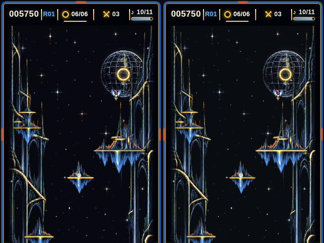

# Graphics port: the browser's picture in C

The goal: the handheld shows what the browser shows. Nothing is redrawn by
hand. Every stage is a port of the arcade renderer and is measured against
the browser's own output, captured with headless Chromium running the real
WebGPU renderer and DOM HUD.

## The pipeline

| Stage | Browser source | C | Proof |
| --- | --- | --- | --- |
| Scene: every sprite, island, ring, prop, popup, banner, menu as instanced quads | `render/scene.mjs`, ring-fx, bird-animation, camera, session feel | `render/struthio_scene.c` (+ generated `struthio_scene_data.c`) | `host/scene_check`: per-tick hash of the instance list equals the browser's on **all 75,144 ticks** of the 5 goldens |
| Sprite pass: depth, premultiplied blend, materials (world + moon + Arcade ambience, bird inks, island palette) | WGSL in `renderer.mjs` | `render/struthio_raster.c` (float reference) | `host/raster_check` at 3x (768x1152) vs WebGPU frames: 35.7–50.6 dB over 18 frames |
| Post: tone, Arcade grade, bloom, scanlines, vignette | WGSL post pass | `st_raster_post` | quality 0 and 2 compared in `raster_check` |
| HUD bar, toasts, frame | DOM + CSS (`hud.mjs`, arcade page) | captured as layers by `tools/reference/hud_capture.mjs`, composed by `st_hud_*` in `struthio_panel.c` | `panel_check --hud`: 43.2 dB vs the DOM render after RGB565 |
| Device panel renderer | (the canvas at 320x480) | `render/struthio_panel.c` + asset pack | `panel_check`: see below |

## What the panel shows

In a 320x480 window the arcade page lays out its 768x1152 canvas at 286x429 at
(17, 50.67), with the HUD bar above and the frame around it. The handheld
reproduces that page with the wing buttons in place of the touch deck.

Showing 768x1152 in 286x429 throws away most canvas pixels. The browser keeps
the nearest one (`image-rendering: pixelated`). The handheld instead targets
the full canvas **area-filtered** down to 286x429, which keeps thin lines,
stars and glyph strokes that nearest-pixel would drop. Textures are
prefiltered to that density offline, so the device samples once per pixel.

## The asset pack

`host/make_pak` turns the browser's exported textures and HUD capture into
`build/assets/struthio.pak` (8.3 MB). The device maps it from the `assets`
flash partition; it is never copied to RAM.

| Entry | Size | Format |
| --- | --- | --- |
| `world_rear`, `world_near` | 286x858 each | RGB565 + ambience bytes: lit, star coverage, moon-disk flag (rear); alpha, gold/cyan glint weights (near) |
| `bird_ink6/1/2/3` | 572x429 each | RGB565 + A8, the player's and rivals' inks pre-applied |
| `atlas` | 763x763 | RGB565 + A8, island palette pre-applied |
| `atlas_hi` | 512x568 | full resolution glyph and swatch strip (drawn magnified) |
| `globe_map`, `globe_lut` | 384x192, disk bbox | the turning moon: longitude map plus each disk texel's row and longitude, so no trigonometry per pixel |
| `chrome` | 320x480 | the page frame, RGB565 |
| 427 HUD layers | 613 KB | run-length coded premultiplied RGBA; round toasts coded against a base toast of the same size |

The ambience (grid, city lights, stars, glints, shooting star) is split three
ways: per texel (baked), per plate row (once a frame) and per frame. The
device evaluates no transcendental function per pixel, except the twinkle of
actual star texels. `host/amb_test` proves the split equals the shader's
formula exactly (worst difference 0.00000).

## Measured

`panel_check` replays a golden through the C sim and scene builder. It renders
the full panel and compares the game picture with the browser's WebGPU frame
area-filtered to 286x429 (quality 0):

| Sampling | PSNR over 18 frames (5 traces) |
| --- | --- |
| nearest (default) | 24.9–30.3 dB |
| bilinear (`BILINEAR=1`, 4 reads) | 28.2–31.2 dB |

For scale, the browser's own nearest-pixel display differs from the same
area-filtered reference by 27–29 dB. The remaining differences sit on
sprite edges, where a footprint straddles two texels; flat areas match. It
also checks that rendering the even and odd bands on two workspaces gives
exactly the single-pass frame (the two-core split on the device).

On the host (x86, one core) a full 320x480 panel frame takes 8–10 ms. **The
ESP32-S3 time is not measured yet.** Measuring it is the first bring-up task
for this renderer.

## Not reproduced

- Bloom, halo, scanlines and vignette (quality 1–2): the C reference has them
  (`st_raster_post`), but the device runs quality 0, tone and Arcade grade
  through lookup tables.
- The island material's music pulse (0–4% brightness on the beat).
- Text anti-aliasing is Chromium's greyscale AA, captured with
  `--disable-lcd-text`.

## Regenerating the references

    node tools/reference/capture.mjs --frames --textures   # headless Chromium, WebGPU via SwiftShader
    node tools/reference/hud_capture.mjs
    make -C host pak
    handheld/run_tests.sh                                   # runs every comparison when build/reference exists

The browser references are large and are not committed. `run_tests.sh` skips
the comparisons when they are missing.
