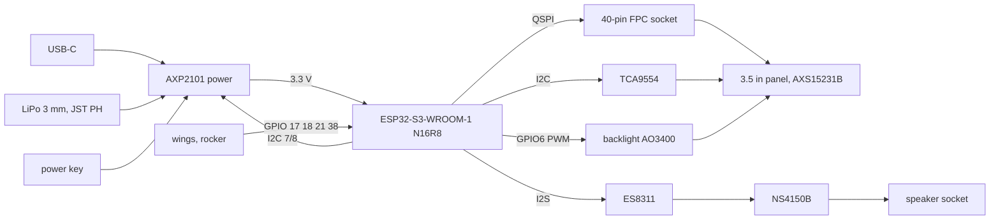

# STRUTHIO TWO SLIM · design spec v0.1

One board that does everything, assembled by JLCPCB; a bare 3.5" panel that plugs into it; nothing to solder.
The ONE SLIM (16.5 mm) stays the current build. This is its successor, in design.

Status of every fact below: **datasheet / reference schematic** unless marked **estimate** or **confirm**.

## 1. Goals, in priority order

1. **No soldering.** The builder plugs in the panel ribbon, the battery and the speaker, and screws the case.
2. **The same game, the same firmware.** Keep the Waveshare's pin map, so the firmware image that runs on the
   ONE SLIM runs on TWO SLIM unchanged (section 4).
3. **Thinner**: about 11-12 mm (section 6), from 16.5.
4. **The same face**: outline 74 × 136, face panel art, wing buttons, rocker; the screen in the same place.
5. **Low risk on the first board**: copy a circuit that is already in production rather than invent one (section 2).

## 2. The reference: Waveshare's own schematic

Waveshare publishes the schematic of the board TWO SLIM replaces (ESP32-S3-Touch-LCD-3.5B rev 2.0,
`files.waveshare.com/wiki/ESP32-S3-Touch-LCD-3.5B/ESP32-S3-Touch-LCD-3.5B_V2.0.pdf`). It is in production and
the STRUTHIO firmware already runs on it. TWO SLIM takes these blocks from it, values included:

| Block | From the reference | TWO SLIM |
|---|---|---|
| Processor | ESP32-S3R8 chip + W25Q128 flash + crystal + PCB antenna | **ESP32-S3-WROOM-1-N16R8 module** instead: the same chip, flash and PSRAM, already certified, no antenna or crystal layout to get right |
| Power | AXP2101: DCDC1 3.3 V via 1 µH 3.5 A, VBUS/VSYS/BAT caps as drawn, NTC on TS, PWRON key with BSS138 echo to SYS_OUT | **copied** |
| USB-C | 16-pin receptacle, 5.1 k on CC1/CC2, ESD diode on VBUS, D+/D- to GPIO19/20 | **copied** |
| Panel | 40-pin 0.5 mm flip-lock FPC: QSPI (CS 12, CLK 5, D0-D3 1-4), touch on I2C, IM0-3 straps (QSPI), backlight LEDA 6.8 Ω from 3.3 V, LEDK switched by an AO3400 on GPIO6 (PWM) | **copied** |
| Audio | ES8311 codec (I2S MCLK 44, BCLK 13, LRCK 15, DOUT 16, DIN 14) → NS4150B class-D amp → 2-pin speaker socket | **copied** (the microphone left off) |
| I/O expander | TCA9554 at 0x20: LCD reset, touch IRQ, AXP IRQ, SYS_OUT, amp enable | **copied**: the firmware drives these through it |
| Camera, SD card, RTC, IMU, expansion header | | **left off**: STRUTHIO uses none of them |

## 3. Block diagram

## 4. Pin map (the Waveshare's, so the firmware does not change)

| GPIO | Use | | GPIO | Use |
|---|---|---|---|---|
| 1-4 | panel QSPI D0-D3 | | 17 | LEFT wing |
| 5 | panel QSPI CLK | | 18 | RIGHT wing |
| 6 | backlight PWM | | 19, 20 | USB D-, D+ |
| 7, 8 | I2C SCL, SDA (AXP2101, ES8311, TCA9554, touch) | | 21 | DART left |
| 12 | panel CS | | 38 | DART right |
| 13, 14, 15, 16 | I2S BCLK, DIN, LRCK, DOUT | | 39 | model strap: left open (= SLIM: power key, 100 mA) |
| 44 | I2S MCLK | | 0 | BOOT key |
| EN | RESET key, RC delay | | 43 | UART TX (test pad) |
| TCA9554 P1 | panel reset | | P2 | touch IRQ |
| P5 | AXP2101 IRQ | | P6 | SYS_OUT (power key echo) |
| P7 | amp enable | | | |

The WROOM-1-N16R8 uses GPIO 26-37 internally for flash and octal PSRAM, exactly as the reference's S3R8 +
W25Q128 do: none of the pins above clash.

## 5. Parts (JLCPCB-placeable, stock checked 2026-10-03)

| Ref | Part | LCSC | Seen |
|---|---|---|---|
| U1 | ESP32-S3-WROOM-1-N16R8 (18 × 25.5 × 3.1 mm) | C2913202 | 1,700+ in stock, from $3.41 |
| U2 | AXP2101 | C3036461 | 1,396, $1.97 |
| U3 | ES8311 | C962342 | 79,642, $0.56 |
| U4 | NS4150B | C189961 | JLC library |
| U5 | TCA9554PWR | C477924 | 13,505, $0.77 |
| J1 | 40-pin 0.5 mm flip-lock FPC, bottom contact, 2.0 mm | C54563269 (or C2856812, C9160) | **confirm** contact side against the panel |
| J2 | USB-C 16-pin | to pick | |
| J3 | JST PH 2.0 battery socket, side entry, SMD | C295747 (used on the SLIM board) | |
| J4 | 1.25 mm 2-pin speaker socket, SMD | to pick | |
| SW1-4 | XKB TS-1187A (wings, rocker) | C318884 (used now) | |
| SW5-7 | power, RESET, BOOT | to pick: side-push switches at the board edge, or the SLIM's printed plunger onto top-push ones | |
| Q1 | AO3400 backlight switch | JLC basic | |
| passives, ESD, inductor | as the reference | at schematic time | |

## 6. Mechanics

**Layout**: one board, 0.8 mm, filling the case. Front side: the panel (taped down, its ribbon through a slot
in the board to J1 on the back), the four key switches under the caps. Back side: the module, the power,
audio and expander chips, the connectors; the battery beside the module.

| Layer, front to back | JHD0350A007 panel (the Waveshare's) | Startek KD035QVFID225 |
|---|---|---|
| Face panel, acrylic | 1.0 | 1.0 |
| Shell rim over the glass | 0.5 | 0.5 |
| Panel (glass, LCD, backlight) | 4.4 (3D model, cover glass included) | 3.24 (listing) |
| Tape | 0.2 | 0.2 |
| Board | 0.8 | 0.8 |
| Module, the tallest part on the back (the 3.0 mm battery beside it) | 3.2 | 3.2 |
| Clearance | 0.2 | 0.2 |
| Back wall | 1.5 | 1.5 |
| **Total (estimate)** | **11.8 mm** | **10.6 mm** |

**Battery**: 303450, 3.0 × 34 × 52 mm, about 500 mAh, JST PH (**confirm** size with the seller): twice the
SLIM's, in the same thickness.

## 7. The panel: the one part to source

The Waveshare's panel is Jinghua (JHD) **JHD0350A007V1** (from Waveshare's 3D model and schematic). It is not
sold publicly. The board is drawn for its 40-pin pinout (section 2), so any 3.5" 320 × 480 AXS15231B panel with
that pinout fits. To ask (**before** the board is drawn in detail):

- Jinghua (JHD): JHD0350A007V1, 1-10 pieces, its datasheet and FPC drawing.
- Startek: KD035QVFID225-C086A in a **QSPI, 40-pin** build (listed as MIPI, 30-pin), datasheet, sample price.

Either answer settles the panel; the other parts are all in stock.

## 8. What the firmware needs

Nothing, if the pin map above holds: same display driver (AXS15231B over QSPI, reset through the TCA9554),
same power code (AXP2101), same audio (ES8311 + amp enable on the TCA9554), same buttons, same model strap.
The firmware never starts the camera, SD card, RTC or IMU, so their absence is invisible (checked:
`firmware/main` has no code for them). Two things tie it to the panel and the reference circuit:

- The panel's power-on table (`board_waveshare_35b.c`, the vendor's init sequence) is written for the JHD panel.
  With the JHD panel nothing changes; with another AXS15231B panel, that table may need the maker's version.
- The amplifier is enabled by the 10 k pull-up on its CTRL pin (the firmware never drives TCA9554 P7): keep it.

**Confirm** on the first board: flash the ONE SLIM image as it is.

## 9. Plan

| Step | Output | Depends on |
|---|---|---|
| 1. This spec | done | |
| 3a. Netlist + schematic | **done (v0.1)**: `netlist.py` (114 parts, 87 nets) → `make_two_slim_sch.py` → `out/struthio_two_slim.kicad_sch` + PDF; KiCad's own netlist read back matches pin for pin | |
| 4a. Floorplan | **done (v0.1)**: `floorplan.py` → `out/floorplan.png`; board 69.6 × 131.5 mm in the SLIM case, every area on the board, nothing overlapping | |
| 2. Panel RFQ | an answer from Jinghua or Startek, a datasheet | |
| 3. Schematic (KiCad, generated like the SLIM board) | ERC clean, every value from the reference | 2 for the FPC pin order |
| 4. Floorplan + case | board outline and placement inside the 74 × 136 case; case model at ~11-12 mm with checks | 3 |
| 5. Layout | DRC clean; module antenna at the top edge, clear of copper and the battery | 4 |
| 6. Two test boards from JLCPCB | about $60-90 for 2 (estimate) | 5 |
| 7. Bring-up | the ONE SLIM firmware image, unchanged | 6 |

## Appendix: the panel request (to send)

**To Jinghua Display (JHD), sales:**
> Hello. We are building a small batch of handheld game consoles and would like to buy your 3.5" TFT
> **JHD0350A007V1** (320 × 480, AXS15231B, QSPI, 40-pin 0.5 mm FPC, with capacitive touch), as used on the
> Waveshare ESP32-S3-Touch-LCD-3.5B. Could you send its datasheet and FPC drawing, and quote 5 and 50 pieces
> with shipping? Thank you.

**To Startek, sales:**
> Hello. We are interested in your 3.5" KD035QVFID225-C086A (AXS15231, 320 × 480). Is it available in a
> **QSPI** build with a **40-pin 0.5 mm** FPC (IM0-IM3 on the FPC), like the panel on the Waveshare
> ESP32-S3-Touch-LCD-3.5B? Please send the datasheet, the FPC pinout and drawing, the AXS15231 initialisation
> code, and a price for 5 samples and for 50 pieces. Thank you.
